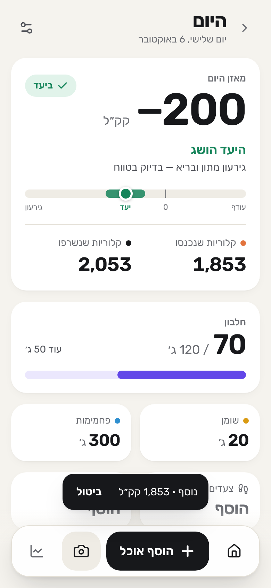
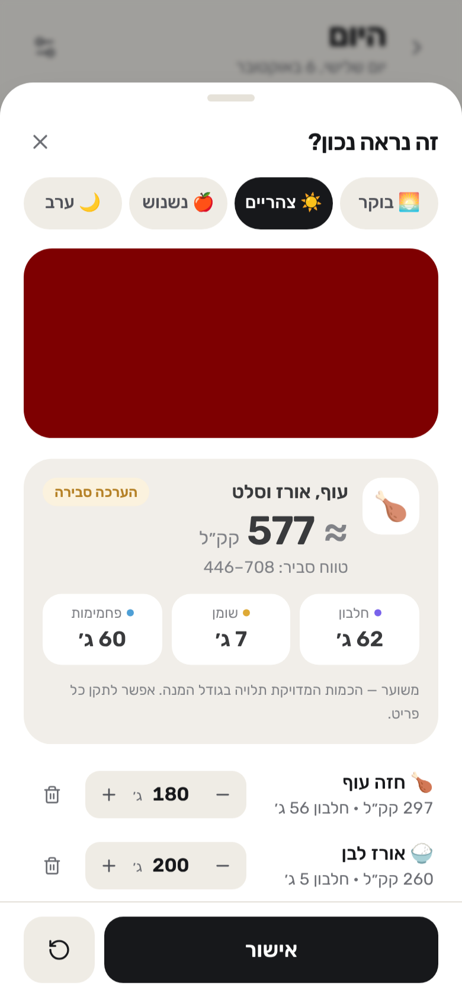
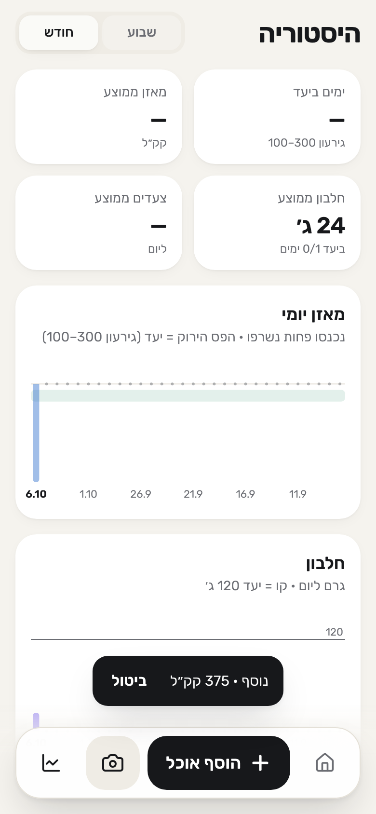
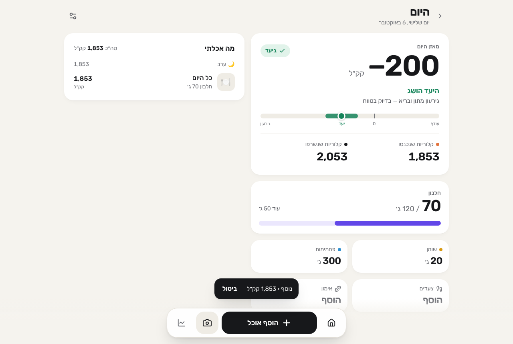

# מאזן — calorie & protein tracker for body recomposition

A Hebrew, RTL, mobile-first PWA built around one question: **"where am I today?"**
Open → see the balance → `+ הוסף אוכל` → type or photograph → `אישור` → close. 10–20 seconds.

| Today (goal reached) | Review an AI/photo estimate | History |
|---|---|---|
|  |  |  |



---

## What it does

- **Today dashboard** — calorie balance (eaten − burned) as the hero number, a number-line gauge with the
  **100–300 kcal deficit** target band, a plain-language status (`היעד הושג` / `כמעט שם` / `עודף קלורי` /
  `הגירעון גדול מהיעד`), **protein vs. 120 g** with emphasis, fat, carbs, steps, workouts, and the food log.
  Mid-day it doesn't scare you with a "huge deficit" — it says how much is left to eat.
- **Food entry** — free Hebrew text (`אכלתי 3 ביצים, 2 פרוסות לחם, קוטג' וסלט`) or a photo (one tap on the
  camera button in the dock). Every estimate is shown as `≈`, with a range for photos, a confidence label,
  per-item sources, and the assumptions. Edit grams with ± or by typing, remove items, or type a correction
  (`זה היה 250 גרם אורז`) — simple corrections are applied instantly on-device, anything else goes to the AI.
- **One-tap re-log** of recent meals, **undo** on every add/delete.
- **Workouts** — run (distance + time → pace + burn), strength (duration + intensity), cycling, swimming, other.
- **Steps** — manual, or from Apple Health through an Apple Shortcuts bridge (see below).
- **History** — week / month: days in target, average balance, protein, steps, three small charts, day list.
- **Daily 21:30 reminder** — `לא שכחת לעדכן את היום? 🥗`, once a day, skipped if the evening is logged.
- **Offline-first** — data lives in IndexedDB; common foods are computed offline by a deterministic Hebrew
  parser; anything else is queued and analysed when the connection returns. Optional Supabase sync.
- Minimal settings: sex, age, height, weight, protein target (default **120 g**), reminder, sync.

## Quick start

```bash
npm install
cp .env.example .env        # optional: add GEMINI_API_KEY (free) for AI text + photo analysis
npm run dev                 # http://localhost:5173 — includes the local /api/analyze-food
```

Without any key the app still works: text is analysed by the built-in Hebrew parser + nutrition table
(photos need an AI key). With `GEMINI_API_KEY` set, the dev server runs the full AI pipeline server-side.

```bash
npm test            # unit tests (vitest)
npm run test:e2e    # Playwright end-to-end, mobile + desktop
npm run build       # typecheck + production PWA build → dist/
```

Requires Node ≥ 22.18 (the dev API imports the shared TypeScript pipeline directly).

## Deploying (Supabase + any static host)

1. Create a Supabase project. Apply the schema: `supabase link && supabase db push`
   (`supabase/migrations/…_init.sql` — tables + Row Level Security).
2. Auth → Email: keep email OTP on and put `{{ .Token }}` in the *Magic Link* template — the PWA signs in with a
   6-digit code (a magic link would open Safari instead of the installed app).
3. Secrets & functions:
   ```bash
   supabase secrets set --env-file .env      # GEMINI_API_KEY, GROQ_API_KEY, … (see .env.example)
   supabase functions deploy analyze-food health-ingest send-reminders
   ```
4. Reminders (optional): `npx web-push generate-vapid-keys`, set `VAPID_*` + `CRON_SECRET`, create the two Vault
   secrets described at the top of `supabase/migrations/…_reminder_cron.sql`, then apply that migration.
5. Build the frontend with `VITE_SUPABASE_URL`, `VITE_SUPABASE_ANON_KEY` (and `VITE_VAPID_PUBLIC_KEY`) and host
   `dist/` anywhere static (Vercel, Netlify, Cloudflare Pages, GitHub Pages). Serve over HTTPS.

## Environment variables

All documented in [`.env.example`](.env.example). Summary:

| Variable | Where | Purpose |
|---|---|---|
| `GEMINI_API_KEY`, `GEMINI_MODELS` | server | Primary AI (free tier). Models tried in order. |
| `GROQ_API_KEY`, `GROQ_MODEL`, `GROQ_VISION` | server | Fallback AI #1 |
| `OPENROUTER_API_KEY`, `OPENROUTER_MODEL` | server | Fallback AI #2 |
| `AI_PROVIDER_ORDER`, `AI_TIMEOUT_MS` | server | Chain order / timeout |
| `USDA_FDC_API_KEY`, `USDA_FDC_DISABLED` | server | USDA FoodData Central lookups for foods outside the table |
| `REQUIRE_AUTH`, `ALLOWED_EMAILS` | server | Protect the free AI quota (signed-in users / allow-list) |
| `VAPID_PUBLIC_KEY`, `VAPID_PRIVATE_KEY`, `VAPID_SUBJECT`, `CRON_SECRET` | server | Web Push reminder |
| `VITE_SUPABASE_URL`, `VITE_SUPABASE_ANON_KEY` | client (public) | Optional sync + hosted functions |
| `VITE_VAPID_PUBLIC_KEY` | client (public) | Push subscription |
| `VITE_API_BASE` | client (public) | Override the analyze endpoint |

AI keys are **never** bundled into the frontend — only `VITE_*` values are, and none of them are secret.

---

## Calorie expenditure algorithm (deterministic — no AI)

Implemented and documented in [`src/domain/energy.ts`](src/domain/energy.ts), unit-tested in
[`energy.test.ts`](src/domain/energy.test.ts).

```
TOTAL = (BMR + BASELINE + STEPS_NET + EXERCISE_NET) × 1.10
```

| Term | Model |
|---|---|
| **BMR** | Mifflin-St Jeor: `10·kg + 6.25·cm − 5·age + 5` (♂) / `− 161` (♀). Energy for 24 h at rest. |
| **BASELINE** | 5 % of BMR — non-walking daily life a step counter can't see (standing, posture, chores). Small on purpose: the classic "× 1.2 sedentary" factor already implies a few thousand steps, which are counted explicitly here. |
| **STEPS_NET** | `steps × stride × kg × 0.5 kcal/kg/km`, stride = height × 0.415 (♂) / 0.413 (♀). 0.5 is the *net* walking cost (gross ≈ 0.75–0.8 minus the resting share already in BMR). |
| **EXERCISE_NET** | Running with a distance: `0.95 kcal × kg × km` (running's net cost is ~speed-independent). Otherwise `(MET − 1) × kg × hours`, METs from the Compendium of Physical Activities (strength 3.0 / 3.5 / 5.0 by intensity; conservative session averages). The "− 1" removes the resting MET already in BMR. Walks are not a workout type — they're steps. |
| **× 1.10** | Thermic effect of food ≈ 10 %. Modelled on expenditure rather than on what you logged (at a near-maintenance intake they're equal), so "burned" doesn't rise just because you ate more. |

**Double-counting guards:** resting energy is counted once (BMR); steps your phone/watch records *during a
logged run* (`minutes × 160` cadence, or distance ÷ running stride) are subtracted before step energy is
computed; walking is only counted via steps.

Sanity checks (tested): 3k steps ≈ BMR × 1.2, 12k steps ≈ BMR × 1.375; 5 km run for 65 kg ≈ 300 kcal;
75 min heavy lifting for 80 kg ≈ 400 kcal.

**Daily goal** ([`src/domain/goal.ts`](src/domain/goal.ts)): deficit = burned − eaten.
`100–300` → success · `0–99` → almost (`חסרות עוד X קלוריות ליעד`) · `< 0` → surplus (gentle wording) ·
`> 300` → "deficit larger than target" — **only once the day is over (after 20:00 or a past day)**; before that
it shows how many calories are still available. The app never recommends aggressive restriction.

## AI nutrition pipeline

```
text / photo
  → AI with the nutrition skill: identify items, edible grams, raw/cooked state, map to table keys
  → zod validation of the model JSON (invalid → next provider)
  → nutrients: curated table (USDA SR Legacy + Israeli labels) → USDA FDC search → AI per-100 g estimate (sanity-checked)
  → calories/macros computed deterministically; totals summed in code; kcal range from portion range
  → result with confidence, assumptions, source per item → client validates again → user confirms/edits
```

- **The model never supplies the final calories.** It decides *what* and *how much*; numbers come from
  [`foodDb.ts`](supabase/functions/_shared/foodDb.ts) (135 foods incl. Israeli staples, per-100 g, portion units,
  composite dishes that list their ingredients to prevent double counting) or USDA FoodData Central.
  Only foods found in neither use the model's own per-100 g estimate, which must pass an Atwater
  consistency check, is labelled `הערכה`, and caps confidence.
- **Skill / system instructions:** [`skills/nutrition-analysis/SKILL.md`](skills/nutrition-analysis/SKILL.md) —
  identification, edible-portion grams, raw vs cooked rules, Israeli & restaurant foods, hidden oil/sauces,
  photo portioning cues, confidence scale, clarification questions, correction semantics, strict JSON schema.
  It's embedded into the edge-function bundle by `scripts/sync-skill.mjs` (a test fails if it's stale).
- **Provider abstraction:** `NutritionAIProvider` in [`providers.ts`](supabase/functions/_shared/providers.ts) with
  `GeminiProvider` and `OpenAICompatProvider` (Groq, OpenRouter, anything OpenAI-compatible). Retries a model
  without JSON-schema/thinking config on HTTP 400; moves to the next model on 404/429; next provider on any failure.
- **Model choice (researched Oct 2026):** Google's free Gemini API tier now offers only Flash / Flash-Lite
  models (Pro left the free tier in April 2026), with per-project RPM/RPD limits that Google changes without
  notice. Flash has vision, native JSON-schema output and good reasoning, so it is primary, configured as a
  chain `gemini-3.5-flash → gemini-3-flash-preview → gemini-2.5-flash` (env-overridable). Groq's free tier
  retired Llama 4 Scout (July 2026) and recommends `qwen/qwen3.6-27b`, which is multimodal with JSON mode →
  fallback #1. OpenRouter's `openrouter/free` router accepts images and routes to whichever free model is live →
  fallback #2. For text, the offline parser is the final fallback.
- **Errors are human:** `לא הצלחתי לנתח את האוכל. נסה לתאר קצת יותר את הכמות.`,
  `התמונה קצת לא ברורה לי…` — never a stack trace or HTTP code.
- Logged to `ai_analysis_logs` (provider, model, latency, success; text truncated to 200 chars; images never stored).

## Apple Health — what's possible and what's built

**A web app / PWA cannot read HealthKit.** Apple exposes HealthKit only to native apps; Safari and home-screen
PWAs have no API for it (Android's Health Connect is likewise native-only). So the app does not pretend.

Implemented bridges, all using Apple's free **Shortcuts** app:

1. **Background sync (recommended, needs Supabase).** Settings → Steps → "צור קוד אישי" creates a personal
   token (only its SHA-256 is stored). A Shortcuts *Personal Automation* (e.g. 21:15 daily, "run immediately"):
   *Find Health Samples (Steps, today)* → *Calculate Statistics (Sum)* → *Get Contents of URL* `POST`
   `…/functions/v1/health-ingest` with `Authorization: Bearer <token>` and JSON `{"steps": <sum>}`. The app picks it
   up on next open. Works with Android automation apps too (same endpoint).
2. **Open-with-URL (no backend).** A shortcut opens `https://your-app/?steps=7842&date=2026-10-06`; the app imports
   and cleans the URL. Caveat (shown in the UI): on iOS the link opens in Safari, whose storage is separate from
   the installed PWA — so this suits Safari-tab, Android and desktop use.
3. **Manual** — tap the steps tile, type the number.

Upgrade path if fully automatic sync is ever needed: wrap the same React app in Capacitor and add a HealthKit
plugin (a small native companion) — the energy model and data layer don't change.

## Reminders — what works where

- A web page can't schedule an OS notification for later (the Notification Triggers API was abandoned).
- **Reliable:** Web Push. `pg_cron` calls `send-reminders` every 15 min; it sends one push per local day at/after
  21:30, and skips users who logged something after 17:00. iPhone/iPad support Web Push **only for PWAs added
  to the Home Screen** (iOS 16.4+); the settings screen explains this.
- **Without a backend:** a local timer fires while the app is open/backgrounded, and an in-app banner appears when
  the app is opened after 21:30 with nothing logged. Never more than one per day.

## Data & security

- Local-first: IndexedDB (records) + localStorage (settings). Sync is optional, last-write-wins on `updated_at`,
  soft deletes so removals propagate.
- Supabase schema in [`supabase/migrations`](supabase/migrations): `profiles`, `food_entries` (items as validated
  JSONB — always read/written with their entry, which keeps offline sync atomic), `exercises`, `health_data`,
  `daily_summaries`, `ai_analysis_logs`, `push_subscriptions`, `health_ingest_tokens`. **RLS on every table**,
  owner-only; the ingest-token hash isn't readable even by its owner. Minimal personal data (age, not birth date;
  no names; no photos stored).
- The analyze function requires a signed-in user by default (protects the free quota), validates the request with
  zod, and validates every model reply with zod; the client validates the server reply again before saving.

## Project structure

```
src/
  domain/        energy.ts (burn model) · goal.ts (status logic) · day.ts (daily summary)
  data/          store.ts (local-first store) · idb.ts · types.ts
  services/      ai.ts · sync.ts · notifications.ts · health.ts · image.ts · supabase.ts · config.ts
  ui/            screens/ (Today, History, Onboarding) · sheets/ (food, review, exercise, steps, settings)
  sw.ts          service worker: precache, Web Push, notification click
supabase/
  functions/_shared/   pipeline · providers · schema (zod) · foodDb · localParser · nutrition · usda · skill
  functions/{analyze-food,health-ingest,send-reminders}/
  migrations/          schema + RLS, reminder cron
skills/nutrition-analysis/SKILL.md
dev/apiPlugin.ts       local /api/analyze-food for dev & preview
tests/                 unit/ · e2e/ (Playwright)
```

## Testing

See [`docs/TESTING.md`](docs/TESTING.md) for the full matrix and latest results.
